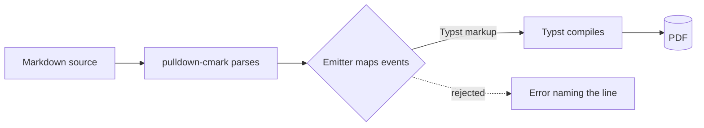
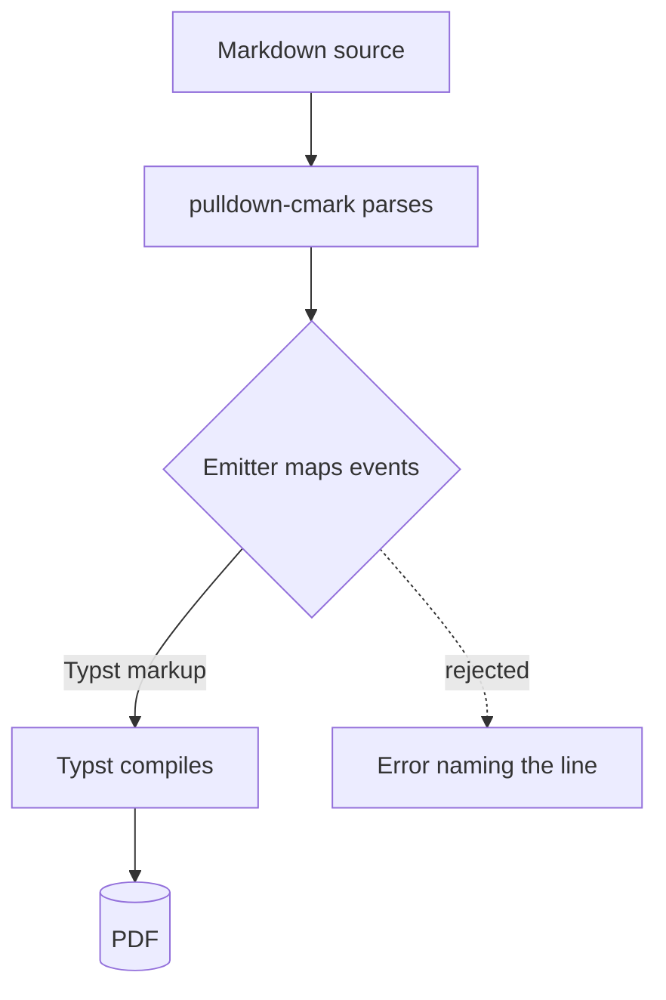
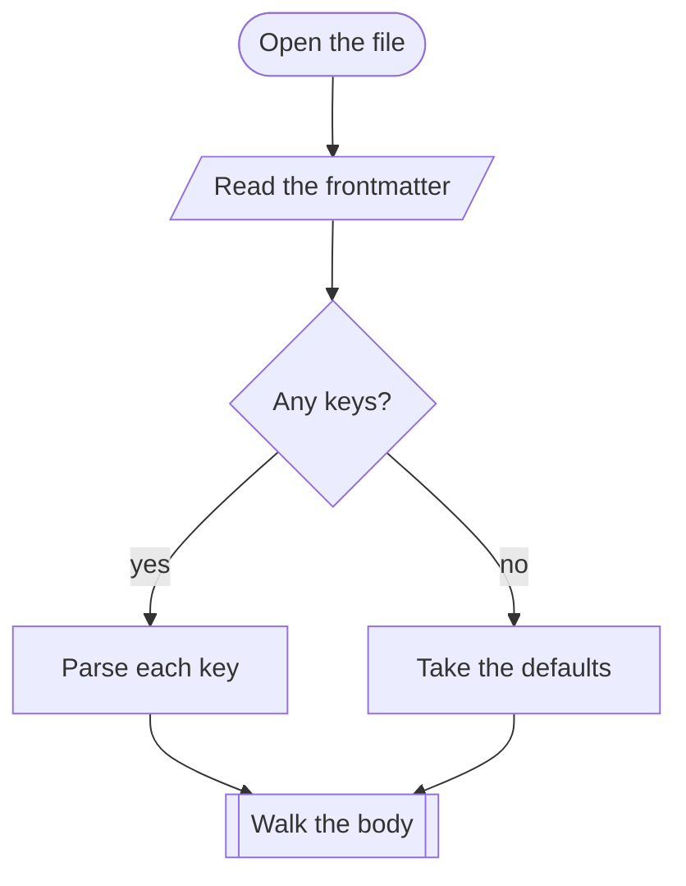
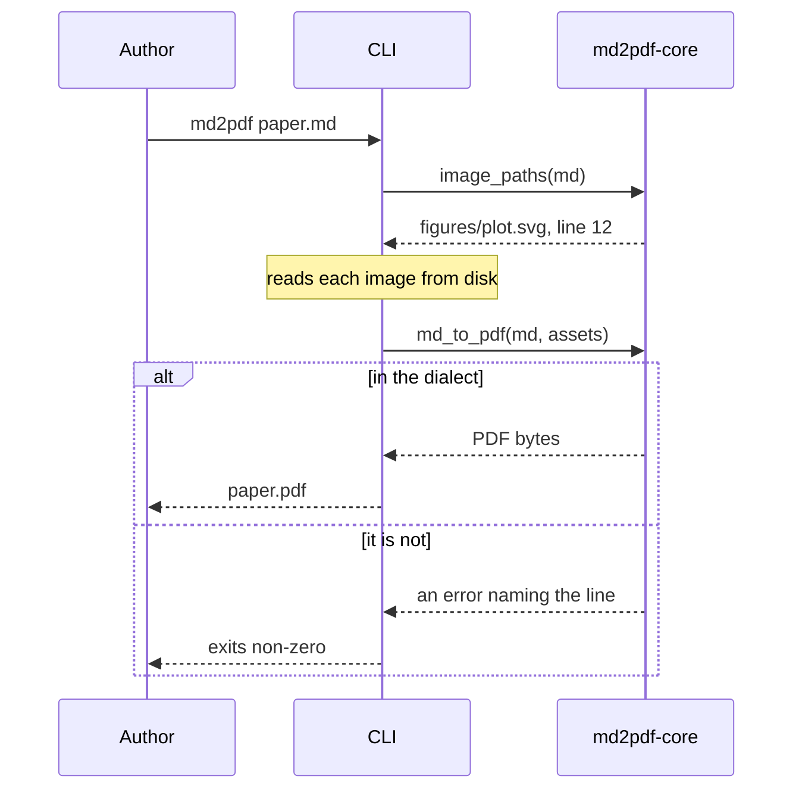
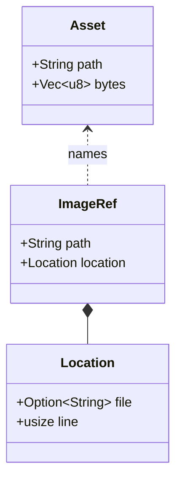
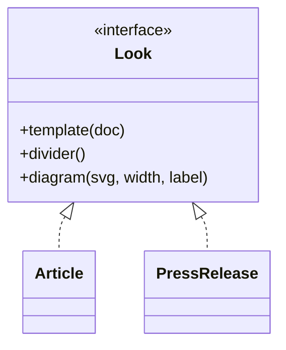
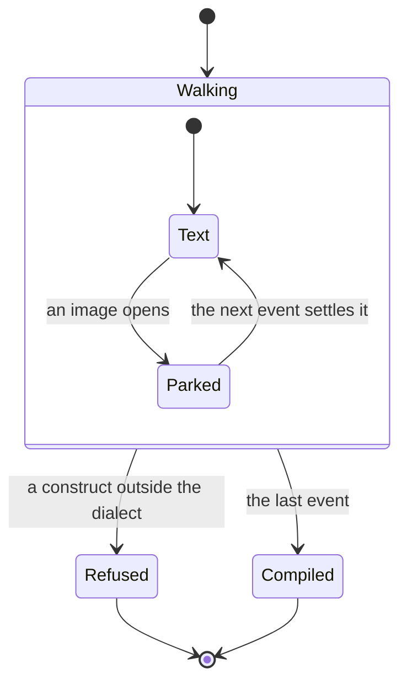
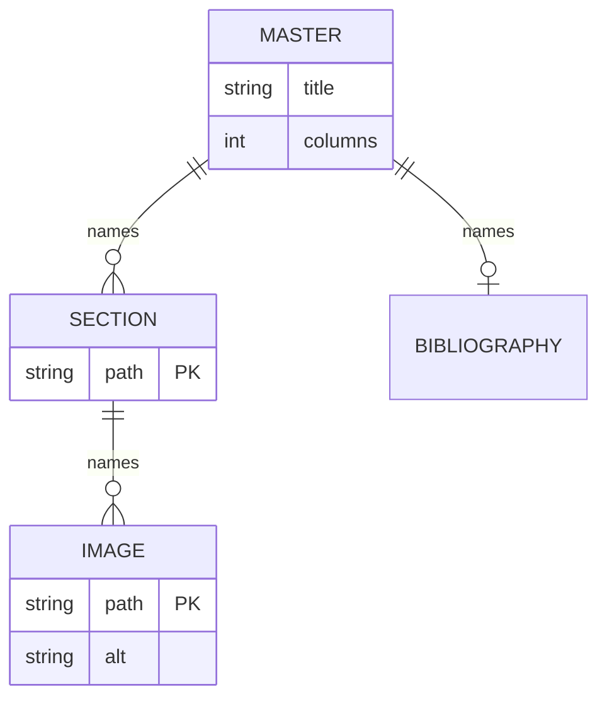

# Introduction

This file holds every kind of diagram md2pdf draws, with a little text between
them. Convert it, open the PDF, then change a diagram here and convert it again.

Each diagram is a fenced block tagged `mermaid`, the same spelling GitHub and
GitLab draw, so this file reads the same way on either of them. Five kinds are
drawn: flowcharts, sequence diagrams, class diagrams, state diagrams and
entity-relationship diagrams. Everything is drawn on your machine, inside
md2pdf, with no browser and no network.

A caption on the line after a diagram makes it a figure: numbered with the
images, and referenceable by the name its caption declares. [](#fig:pipeline)
is the first one below, and this sentence found its number by that name.

# Flowcharts

A flowchart is written `flowchart` and a direction: `LR` for left to right,
`TB` for top to bottom. Nodes take their shape from their brackets, and an edge
can carry a label.



: The pipeline, left to right. {#fig:pipeline}

The look decides how big a diagram is. Its labels set at the size of the
captions, and a diagram is never enlarged. [](#fig:pipeline) is too wide for a
column at that size, so it floats across the whole page, to the top or the foot
of one. A long left-to-right chain gets small that way. When one does, lay it
out top to bottom, as [](#fig:pipeline-down) does, and the same chain stays one
column wide.


: The same pipeline, top to bottom. {#fig:pipeline-down}

`graph` is the older spelling of `flowchart`, and draws the same way. The
diagram below has no caption, so it is not a figure: it has no number, it sits
exactly where it is written, and it never floats.



# Sequence diagrams

A sequence diagram is written `sequenceDiagram`. Each participant is a column,
each message an arrow between two of them, and a note or an `alt` block says
what the arrows alone cannot.



: The CLI asks the engine twice. {#fig:sequence}

As [](#fig:sequence) shows, the images are named before anything is compiled,
so the CLI knows which files to read before it asks for the PDF.

# Class diagrams

A class diagram is written `classDiagram`. A generic is written with tildes,
`Vec~u8~`, because an angle bracket would open HTML where Mermaid is drawn in a
browser, and it is typeset with its angle brackets, as `Vec<u8>`.



: What the caller supplies, and what names it. {#fig:assets}

`classDiagram-v2` is the same diagram under a second keyword, and so is the
figure below. It draws an interface and the two looks that meet it.



: The call contract, and the two looks that meet it. {#fig:looks}

# State diagrams

A state diagram is written `stateDiagram`, or `stateDiagram-v2`, which is the
same thing. `[*]` is where it starts and where it ends, and a state can hold
states of its own.



: The walk, and the two ways it ends. {#fig:walk}

In [](#fig:walk) the walk parks an image because its form is known one event
late: whether it stands alone in its paragraph is only known once the next
event arrives.

# Entity-relationship diagrams

An entity-relationship diagram is written `erDiagram`. Each line joins two
entities, and the marks at each end say how many of each there can be. An
entity can list its attributes, and a key is marked `PK`.



: What a master names, and what its sections do. {#fig:master}

The relationship labels in [](#fig:master) set a little smaller than the entity
names, because Mermaid draws them smaller.

# Showing Mermaid source instead

To show Mermaid source as code rather than draw it, tag the fence anything
other than `mermaid`, such as `text`, and it sets as a listing:

```text
flowchart LR
    a[Read] --> b[Write]
```

The tag must be exactly `mermaid`, in lower case. A block may not carry its own
configuration: an `init` directive anywhere in it, or front matter opening it,
is an error naming its line, because the look owns how a diagram looks. A
diagram stands at the top level of a file, not inside a list item, a block
quote, a footnote or a figure group.
