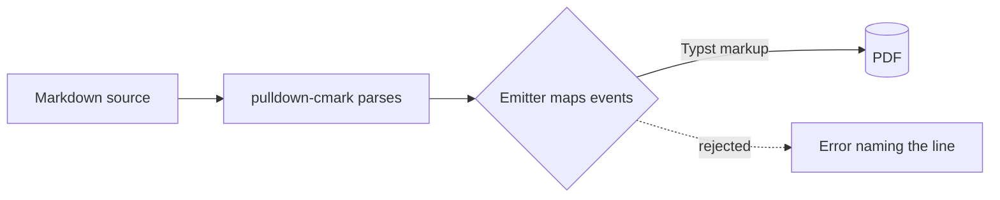

# diagrams-mermaid

## 1. Goal

Typeset the diagrams an author writes in Mermaid. **The observable is unchanged from
`mpdf-001` — the typeset PDF that Typst compiles from the user's markdown — but what a
fence can put on the page widens:** a fenced block tagged `mermaid`, which today
typesets as a listing of its own source, becomes the diagram that source describes.

The consumer is an author who already writes Mermaid, because GitHub, GitLab and most
markdown editors draw it:

````markdown
The walk hands each construct to the emitter, and a rejection stops it:



: The pipeline, drawn. {#fig:pipeline}

As [](#fig:pipeline) shows, the emitter sits in the middle.
````

Today that block sets as *Listing 1*, a code listing of five lines of Mermaid. After
Phase 1 it sets as *Figure 1*, a diagram whose labels are the size of the caption
beneath it, floating across both columns because it is too wide for one. The reference
reads *"Figure 1"*, and the file still renders the same way on GitHub.

### 1.1 Why this is a spec and not a phase of another

The methodology's §6.1 is an ordered test, worked here in full.

- **Step 0 — does this change a decision?** Yes, three: a fence tag gains a meaning,
  `core` gains a dependency, and the looks gain a sizing rule.
- **Step 1 — does it remove or contradict shipped work?** No construct is removed, but
  two shipped statements stop being wholly true, and a third, a design decision,
  gains an exception.
  - `mpdf-001` Phase 4 shipped *"fenced and indented code blocks become block-level raw
    content"*, with the language tag carried through. For the tag `mermaid` that stops
    being true. Code blocks still ship, every other tag is untouched, and Mermaid source
    is still reachable as a listing under any other tag (§2).
  - `mpdf-001` Phase 14 shipped a licence notice saying *"None is copyleft"*, and a test
    that holds the licence table to it. merman brings MPL-2.0 into the tree (§2), so the
    notice's sentence and the test's assertion both change. `--licenses` still prints a
    notice, derived by the suite.
  - `mpdf-005` recorded that *the look contract does not widen for a caption*. A
    diagram's caption does cross into the look, for a reason §2 records against that
    decision. Every caption `mpdf-005` designed still crosses nothing.

  **Narrowing a rule for one value, or making one exception to a decision, is not
  removing what was built.** The prose does go stale, and that is a different
  instrument. Phase 1's close-out puts a dated `CORRECTED` note beside each of the three
  passages, per §6.1 step 1's third bullet.
- **Step 2 — is the subject one an existing spec owns?** No. `mpdf-001` owns the dialect
  and reserves nothing about diagrams. `mpdf-002` owns images **the caller supplies**,
  and a diagram is drawn inside `core` with nothing supplied. `mpdf-005` owns captions,
  numbers and references. A diagram uses them, and adds the one exception above.
  `mpdf-008`'s relocation carries a diagram's errors to its section file unchanged.
  Math is the precedent: a new construct in the dialect, with a converter crate behind
  it, got a spec of its own, related to `mpdf-001`.
- **Steps 3 and 4.** Nothing reserves a framework this would be a kind of, so
  **`extends` stays `null`**, and step 4 lands it: a new spec. It reserves a namespace of
  its own, in §2's last subsection.

### 1.2 Non-goals

- **Not every Mermaid diagram.** "Mermaid" is whatever mermaid.js parses at a given
  version, and there is no specification a renderer can be faithful to. The dialect
  names a closed list of types (§2), and a type outside it is refused by name.
- **No author presentation.** Directives (`%%{ … }%%`, anywhere in a block) and YAML
  front matter inside a block are refused (§2). The look owns how a document looks, and
  the sizing rule depends on the label size the renderer used. `classDef`, `class` and
  `style` lines are diagram syntax, not configuration, and pass through.
- **No interactivity.** `click`, links and tooltips have nowhere to go in a PDF, and
  merman's strict security level drops them.
- **No font-accurate measurement.** Labels are measured by merman's built-in,
  font-agnostic measurer. OQ-2 records why measuring with the look's own font is
  deferred rather than rejected.
- **No diagram inside a list item, block quote, footnote or `:::` group.** Refused in
  Phase 1, for the reason §2 gives. OQ-1 carries the lifting.
- **No change to `md_to_html`.** A `mermaid` fence reaches HTML as
  `<pre><code class="language-mermaid">` through
  `core/src/lib.rs:md_to_html`. That is the hook mermaid.js itself looks for, so a page
  that loads mermaid.js draws it. This crate does not.
- **No change to the asset contract.** `core/src/lib.rs:image_paths` does not list a
  diagram, because the caller supplies nothing for one.
- **No desktop-app work.** Letur depends on `md2pdf-core` by version and gets diagrams
  from the release that carries them. Its file panel lists files by
  `core/src/emit.rs:IMAGE_EXTENSIONS`, which does not change.
- **No raster output, no dark theme, no per-look theme.** OQ-5 records the last.

## 2. Design

`core` gains two direct dependencies, one of them already in the tree, plus one module,
one error variant, and a second branch in two places where the emitter already writes
blocks. Both looks gain one exported function. Nothing else in `core` changes: not
`core/src/lib.rs:TypstWorld`, and not the three asset channels. Four licence sites
change where MPL-2.0 makes them false: the generator, the CLI's notice, one CLI test
and one README section. The CLI's flags do not change.

### Why merman, and nothing else (decision, recorded)

`core` touches no filesystem, clock or network, and compiles to `wasm32` as well as
natively (`rules/pipeline.md`). Every route to Mermaid was measured against those two
rules.

- **mermaid.js, through mermaid-cli**, needs Node and a headless Chromium. It is a
  subprocess `core` cannot spawn, and it would make the CLI stop being one binary.
- **Kroki, mermaid.ink and the like** are network services that receive the author's
  document. Refused on both counts.
- **A Typst package with a WASM plugin** resolves through Typst's registry, which
  `core/src/lib.rs:TypstWorld` deliberately cannot reach. That is the reason `mpdf-004`
  took `mitex` as a crate and not as a package.
- **`mermaid-rs-renderer` 0.3.1**, the most downloaded Rust renderer, breaks both rules.
  It loads every system font through `fontdb` and caches the chosen face under
  `~/.cache/mmdr/font-cache/`: the spike's first run wrote a 773 KB file there, and its
  render path calls the measurer directly, so its "fast text" option does not avoid it.
  And it **panics on `wasm32-unknown-unknown`**, because `compute_layout` calls
  `Instant::now()` unconditionally; every diagram trapped. It also left `Vec~u8~`
  unconverted in a class diagram (Mermaid renders `Vec<u8>`) and overlapped two edge
  labels in a state diagram.
- **merman 0.8.0-alpha.6 meets both.** It ran on `wasm32` under Node with **no
  imports**. Five of seven diagrams were byte-identical to native, and the other two
  differed only in the last digit of trig-derived coordinates (`-2.013397210557766`
  against `-2.0133972105577667`). The same source rendered twice was byte-identical
  every time. Its layout matched Mermaid's own, which is what it is checked against.

The dependencies:

- `merman = { version = "=0.8.0-alpha.6", default-features = false, features =
  ["svg"] }`. The exact pin is because it is alpha. merman's default feature set,
  `complete-svg`, is `svg` plus the Cytoscape layout engine plus math labels, so turning
  the defaults off drops those two, neither of which a listed type needs. The EPL-2.0
  ELK layout and the system clock, time-zone and randomness adapters are opt-in either
  way and stay off.
- `serde_json = "1"`: merman's site config is built by `MermaidConfig::from_value`,
  which takes a `serde_json::Value`, and merman does not re-export the crate. It is
  already in the tree at 1.0.151, so no crate is added.

### What it costs, accepted (decision, recorded)

Measured on 2026-09-20 and accepted by the user the same day:

- **36 crates** join `Cargo.lock`, which goes from 388 to 424 packages. No existing crate
  moves version and none is duplicated.
- **The CLI binary grows by 11.7 MB, or 34%**, from 34.9 MB to 46.5 MB under the
  workspace's release profile on `aarch64-apple-darwin`.
- **The `wasm32` build grows by at most 9.6 MB, 3.0 MB gzipped**: a merman-only module
  with full LTO and `opt-level = "s"`, measured as an upper bound, since std, serde and
  regex are already in `core`'s build. `core` with merman builds for
  `wasm32-unknown-unknown`, exit 0 in 55 s.
- **The minimum Rust version becomes 1.95.** merman declares `rust-version = "1.95"`,
  and md2pdf declares none. Cargo refuses an older toolchain for a dependency that
  declares one, so the floor moves silently for every downstream builder, Letur
  included.
- **MPL-2.0 enters the tree**, through `cssparser`, `cssparser-macros`, `selectors` and
  `dtoa-short`, which reach it via Cloudflare's `lol_html`. `merman-core` depends on
  `lol_html` unconditionally, for label sanitisation, so no feature set avoids them.
  `(Apache-2.0 OR MIT) AND BSD-3-Clause` arrives with `encoding_rs`, and `lol_html` is
  BSD-3-Clause, both terms the tree already has.

**What MPL-2.0 asks, and where each obligation is met.** It is copyleft per file: it
reaches the MPL files and changes to them, never the program around them (its §3.3,
"Larger Work"). A binary that carries those files must ship the licence text and tell
its recipient where their source is. Neither happens on its own today.

- **The text.** `tools/third-party-licenses.py:identify` classifies a licence file by its
  words and has no branch for the Mozilla licence. Run on `cssparser`'s,
  `cssparser-macros`' and `dtoa-short`'s `LICENSE` files, it returns nothing, so all four
  crates would fall into the generated file's list of crates whose text is not
  reproduced, a list whose prose says they ship no licence file. `selectors` ships none,
  and the other three do. Phase 1 adds the branch, so `--licenses=full` carries the
  text once.
- **The source.** The generated file names each crate and version and says nothing
  about where its source is. Phase 1 adds one sentence to the generator's header.

Four places state or check that nothing is copyleft, and each changes:

- `cli/src/main.rs:NOTICE` says *"None is copyleft, so what they ask for is
  attribution, which is this notice."*
- `cli/tests/cli_test.rs:the_notice_states_the_facts_the_table_and_the_font_directory_hold`
  asserts that no licence term in the table contains `MPL`. `mpdf-001` Phase 14's gate
  is what made that sentence a checked claim, and it fails on the dependency whatever
  the notice says.
- `README.md`'s Licence section says *"there is no copyleft anywhere in it"*, and gives
  a crate count.
- `mpdf-001` Phase 14's shipped prose, per §1.1.

**The test is rewritten to keep checking a claim, not deleted.** Every table row whose
terms include a copyleft term must be MPL-2.0 — GPL, EUPL, CDDL, EPL and OSL stay
refused — and must be named in the notice. The notice must no longer carry "None is
copyleft". merman's version is read off the table into the notice, as `mitex`'s is.

The notice is capped at 50 lines by
`cli/tests/cli_test.rs:licences_run_without_a_document_and_a_document_runs_without_them`
and is 39 today. A merman entry in the `mitex` entry's shape and the rewritten paragraph
fit, but only just, so the rewrite is written to the cap rather than raising it:
`mpdf-001` Phase 14 set the cap as "one page".

### Why a `mermaid` fence, and exactly that tag (decision, recorded)

The trigger is a fenced block whose tag — the first word of its info string, as
`core/src/emit.rs:step` already reads it — is exactly `mermaid`. That is the spelling
GitHub and GitLab draw, so a file keeps one meaning across the places it is read.

- **Exact and case-sensitive.** ` ```Mermaid ` stays a listing. A second spelling would
  be a second meaning to document, for no author who asked for it.
- **Mermaid source can still be shown as code**, under any other tag: ` ```text `, or
  ` ```mmd `. The README says so beside the feature, because an author writing *about*
  Mermaid needs exactly that exit.
- **An indented block is never a diagram.** It has no info string, so it has no tag.

### Why the dialect bounds the types (decision, recorded)

The allowed list is a table in `core`, keyed on the type id merman's detection reports
through `Engine::parse_metadata_sync`, which runs before any layout:

| type id | keywords that reach it | alt text | phase |
|---|---|---|---|
| `flowchart-v2` | `flowchart`, `graph` | `flowchart` | 1 |
| `sequence` | `sequenceDiagram` | `sequence diagram` | 1 |
| `classDiagram` | `classDiagram` | `class diagram` | 2 |
| `stateDiagram` | `stateDiagram`, `stateDiagram-v2` | `state diagram` | 2 |
| `er` | `erDiagram` | `entity-relationship diagram` | 2 |

The keyword-to-id mapping was probed on 2026-09-20. `flowchart-elk` reports its own id,
so the list refuses it, and ELK is not compiled in anyway.

A type outside the list is refused with the keyword as the author wrote it. **Keying on
the id and not the keyword** is what folds `graph` into `flowchart`, and
`stateDiagram-v2` into `stateDiagram`, without a second table.

**The keyword and its line are found by one rule**, because detection returns only the
id: they are the first word of the block's first non-blank line that does not begin with
`%%`. That is the line merman's own comment clean-up leaves first. By then the scan
below has refused every directive, so no `%%{` line can be mistaken for a comment.

**Why these five and not more.** They are the ones the spike rendered and read by eye.
`pie` rendered too, but a page-wide pie is oversized for what it says (OQ-3). `gantt`
reads dates and draws a "today" line, which merman's deterministic runtime pins to a
fixed clock: a page would show a false today. Every other type is unmeasured. A later
phase adds a type with a fixture, one at a time, the way `mpdf-004` grows its list.

### What an author may not write inside a block (decision, recorded)

Before detection, a textual scan refuses two things, naming the line each stands on:

- **`%%{` anywhere in the block** — a directive, `%%{init: …}%%` among them, whether it
  opens a line, follows diagram text on the same line, or sits inside a `%%` comment.
  merman looks for `%%{` across the whole input, not at line starts
  (`directive_blocks_controlled` in merman-core's preprocessing), and applies `init` and
  `initialize` wherever it finds them. A line-start check would pass
  `A --> B %%{init: {"themeVariables": {"fontSize": "30px"}}}%%`, and merman would render
  with it.
- **a first non-blank line whose trimmed content is `---`** — YAML front matter, which
  carries `config:` and `title:`. It is trimmed because merman's own front-matter reader
  accepts indentation, trailing whitespace and a CRLF around the dashes, and a literal
  comparison would pass `--- ` with its `config:`.

A plain `%%` comment passes.

**The scan is textual rather than a reading of merman's parsed config**, and this was
measured: a malformed directive, `%%{init: {"theme": }}%%`, was *silently ignored* and
the diagram rendered. A check on the parsed result would pass exactly the case an author
most needs told about.

**Why refuse at all.** A directive can set `theme`, `fontSize` or spacing, and the
sizing rule below assumes the label size the renderer used. A dark theme in a print
document, or 30 px labels in a figure sized for 16, is the look's decision overruled by
a line in the body. Front matter's `title:` duplicates the caption, which is this
dialect's way of titling a figure.

### The errors, and the line each names (decision, recorded)

One new variant, `Error::Diagram { location, problem }`, displayed as
`diagram error {location}: {problem}`, in the shape of `Error::Math`. It joins
`core/src/lib.rs:location_mut`, which is what lets `core/src/sections.rs:relocate`
translate its line into the section file it came from.

The fence's line comes from the block's end event, whose range starts where its start
did (the rule recorded on `core/src/emit.rs:Lines`), so nothing is kept between the two
events.

| case | problem says | line |
|---|---|---|
| no type detected — a misspelt keyword, an empty block, comments only | no diagram type is recognised | the fence's |
| a type outside the list | its keyword, and the list | the keyword's |
| a directive or front matter | which of the two | that line |
| a syntax error | merman's own message | the line its span starts on |
| any other render failure, a resource budget among them | merman's own message | the fence's |
| a diagram in a list item, block quote, footnote or group | where it stood | the fence's |

**A syntax error's line is computed, not guessed.** merman reports it as
`RenderError::Parse` carrying a terminal diagnostic, whose details hold a byte span
into the block. merman maps that span back through its own preprocessing to the text
it was given. The block's first line is the one after the fence, so the line is the
fence's plus one plus the newlines before the span's start. Measured on a sequence
diagram: `Diagram parse error (sequence): unexpected text; expected plus, minus,
central, num, actor`, with span 47..63, which starts on the block's third line. A
diagnostic without a span falls back to the fence's line.

**The fifth row is not gated.** No fixture reliably reaches a render failure that is
neither a detection nor a parse error under the shipped configuration. The arm exists so
that such a failure is a named error at a line rather than a panic.

**What merman accepts leniently is accepted**, as `mpdf-004` accepts what `mitex`
repairs. Measured: a dangling `B -->` followed by `C --> D` on the next line renders as
`B --> C`, the line break read as part of the arrow. The promise is about which types
are accepted, not about every way a diagram can be malformed.

### How the SVG reaches Typst: inline, not as a file (decision, recorded)

The emitter writes the SVG into the Typst source as bytes:
`image(bytes("<svg …>"), format: "svg")`, the string escaped by
`core/src/emit.rs:typst_string`, which already handles `\`, `"` and newlines. On
2026-09-20 a 19 KB source carrying one diagram this way compiled to a PDF through the
bundled looks and fonts.

- **A diagram adds nothing to `md_to_typst`'s output that a caller must supply.** The
  output names the images and bibliography the document names, as it does today, and
  nothing more.
- **The world does not change.** A diagram bound under a name would need a name no
  author path can collide with, and `core/src/lib.rs:TypstWorld` binds everything under
  `VirtualRoot::Project`, the root author paths land in.
- **The cost**: `md_to_typst`'s output grows by the SVG, 12–33 KB per diagram for the
  five listed types in the spike's corpus. A golden file holding it would track merman's
  output byte for byte, and native and `wasm32` differ in the last digit of some
  coordinates. So **golden tests assert the call's shape, never the SVG's bytes**
  (Phase 1's gate).

**Those last-digit differences do not reach the PDF.** On 2026-09-21 the native and the
`wasm32` SVG of each differing diagram, state and pie, were compiled through `md_to_pdf`.
The SVGs differ, and the PDFs are byte-identical (13,804 and 14,865 bytes), because
usvg reads coordinates at a precision the sixteenth digit does not survive. So
`rules/pipeline.md`'s "the same markdown compiles to the same PDF on every machine"
still holds for the measured cases.

### The render configuration, fixed in `core` (decision, recorded)

One configuration, passed as merman's site config — the host-owned layer beside the
author's source — through `MermaidConfig::from_value`:

- **`theme: "neutral"`**: greyscale, which both looks are.
- **Print spacing**: flowchart `nodeSpacing` and `rankSpacing` 30, `padding` 8,
  `diagramPadding` 4; sequence `actorMargin` 20, `messageMargin` 25, `diagramMarginX`
  10, `width` 100, `mirrorActors: false`. Mermaid's defaults are sized for a screen.
  These made the spike's flowchart 18% narrower (1206 → 993 px) and its sequence diagram
  24% narrower (822 → 624 px), and lifted the worst page-wide label from 6.0 pt to
  7.3 pt. `mirrorActors: false` drops the second row of actor boxes a sequence diagram
  repeats at its foot.
- **`SvgPipeline::resvg_safe()`, always.** merman's default SVG puts flowchart, class,
  state and ER labels in `<foreignObject>` HTML, which usvg, and so Typst, does not draw:
  12, 11, 10 and 7 labels lost in the spike's corpus. The resvg-safe pipeline rewrites
  them as SVG text, and all came back.
- **The engine's deterministic runtime.** merman keeps the clock, time zone and
  randomness out of `SvgEnvironment` deliberately. They belong to the engine's
  `RuntimePolicy`, which `Engine::new()` sets to `RuntimePolicy::deterministic()`, a
  clock fixed at the Unix epoch. **Never swap it for `Engine::try_native`**, which is
  what would make output depend on the day it was rendered.
- **`ParseOptions::strict()`.**
- **No `fontFamily`.** Typst draws SVG text in a family the SVG names when its font book
  has it, and otherwise in the families of the text at the image's location: typst-library
  0.15.1's SVG font resolver chains the document's `text.font` after the SVG's own list,
  and skips generic families. Mermaid names `"trebuchet ms", verdana, arial, sans-serif`,
  none of which `core` bundles, so **every label is drawn in the look's own font**, and a
  look with a different font gets it with nothing in `core` knowing.

**The spike ran with two settings this configuration leaves out**, and neither moves a
number above. It set `fontFamily: "Libertinus Serif"`. merman's deterministic measurer
ignores the family, and all seven of the spike's viewBox widths were re-measured without
it and came out identical. It also set `state.padding: 4`, which touches only state
diagrams, and the spike's state diagram is 248 px either way. Phase 2 measures its own
fixtures under the shipped configuration.

**Why fixed in `core` rather than per look.** The SVG is drawn before Typst runs, so a
look can size it and cannot restyle it. Both bundled looks are greyscale serif print, so
one configuration is honest today. A look that wants colour is OQ-5.

**Labels are measured by merman's built-in measurer**, which is deterministic and
font-agnostic. Against advance widths read from the bundled Libertinus Serif files, it
was within about 8% on the spike's stress labels. It underestimates wide capitals most:
ten `W`s measured a 196 px box where Libertinus needs 212. Nothing overflowed at default
padding. OQ-2.

### How big a diagram is (decision, recorded)

Typst draws an SVG at 96 dpi, so 1 px is 0.75 pt, and Mermaid's 16 px labels are 12 pt
at natural size. Today an image is drawn at natural size, shrunk to fit its column.
Measured in `article` at two columns, that puts diagram labels anywhere from **2.9 pt**
(a wide flowchart) to **12 pt** (a narrow class diagram), beside 10 pt body text. The
rule is:

1. **Labels set at the look's caption size**: 9 pt in `article`, 9.5 pt in
   `press-release`. That is 0.5625 pt per px in `article`. A diagram is never enlarged.
2. **If that is wider than the column, the diagram stays in the column while shrinking
   it to fit keeps its labels at 8 pt or more.** That is exactly when its caption-size
   width is at most 9/8 of the column in `article`, and 9.5/8 of it in `press-release`.
3. **Otherwise, a captioned diagram floats across the page**:
   `placement: auto, scope: "parent"`, in a look with more than one column.
4. **Wider than the page, it shrinks to the page.** No refusal. This was decided on
   2026-09-20, over refusing below a floor: a small diagram the author can see and fix
   is kinder than a document that will not convert. The README tells them how to fix it.

**"Labels" means the renderer's 16 px text**, which is every node label in the five
listed types, and what `label-px` below carries. Some secondary text is drawn smaller:
an ER diagram's relationship labels are 14 px, so they set at 7/8 of the size the rule
gives the node labels. The rule does not chase them.

Measured through the whole pipeline on a document of seven captioned, referenced figures,
with label size confirmed from glyph heights (a PDF line box is 1.14 × the font size):

| article, 2 columns | flowchart | sequence | class | state | ER | pie | labels |
|---|---|---|---|---|---|---|---|
| today | 2.9 | 4.2 | 12 | 12 | 8.6 | 5.6 | 12 |
| the rule, print spacing | **7.3 W** | 9.0 W | 9 | 9 | **8.6** | 9.0 W | 9 |

W means the diagram floated across the page. With one column, the rule gives the
caption size to every diagram but the flowchart, which gets 7.3 pt. **Without step 2,
the ER diagram went page-wide to gain 10 pt of width** — 227 pt of diagram against a
217.7 pt column — which is what the tolerance is for.

**How fast "wider than the page" arrives** was measured on left-to-right chains with
four-word labels, at print spacing: page-wide labels are 9.0 pt at 3–4 nodes, 8.4 at 5,
7.0 at 6, 5.2 at 8 and 4.1 at 10. The same chains laid out top-to-bottom stay 87 pt
wide. That is the README's advice.

**An uncaptioned diagram never floats.** It sets at the caption size when that fits its
column, and otherwise shrinks to the column, whatever that does to its labels. A float
leaves the text that mentions it, and a reader finds it again by its number, which only
a caption gives. `core/src/emit.rs:splice_caption` records the same principle for every
block: the caption is what makes a figure.

### Why the look owns the rule, and the call it meets (decision, recorded)

The rule needs the caption size and the page's geometry, and both are the look's. The
looks already decide what a caption and a number look like. So the emitter writes a
call and the look decides at layout time.

**The call.** Uncaptioned, with illustrative numbers:

```typst
#diagram(bytes("<svg …>"), 993.2, 16, alt: "flowchart")
```

and once `core/src/emit.rs:splice_caption` has rewritten it for a caption:

```typst
#diagram(bytes("<svg …>"), 993.2, 16, alt: "flowchart", caption: [The pipeline, drawn.], name: label("fig:pipeline"))
```

- The second argument is the SVG's width in px, **copied verbatim from the root
  `viewBox`'s third number** — `993.1999999999998` as merman writes it, not the rounded
  figure above — so no float formatting of the emitter's enters the source. merman's
  output exposes only the SVG string.
- The third is the label size the SVG was drawn at. It is merman's default, which `core`
  does not change, and it is passed rather than assumed, so the look carries no hidden
  constant of the renderer's.
- `name:` appears only when the caption declared one.

**The function**, in each look, with that look's caption size and margin written as
literals beside the rules that set them:

```typst
#let diagram(svg, px-width, label-px, alt: none, caption: none, name: none) = context {
  let label-size = 9pt                    // this look's caption size
  let floor = 8pt
  let text-w = page.width - 2 * 2.5cm     // this look's margin
  let cols = page.columns
  let col-w = (text-w - (cols - 1) * 0.04 * text-w) / cols
  let want = px-width * label-size / label-px
  let in-col = calc.min(want, col-w)
  let wide = caption != none and cols > 1 and label-size * (in-col / want) < floor
  let img = image(svg, format: "svg", alt: alt,
    width: if wide { calc.min(want, text-w) } else { in-col })
  if caption == none { img } else {
    let f = figure(img, kind: image, caption: caption,
      placement: if wide { auto } else { none },
      scope: if wide { "parent" } else { "column" })
    if name == none { f } else { [#f#name] }
  }
}
```

`0.04 * text-w` is Typst's default column gutter, which neither look sets.
`kind: image` makes a diagram a *Figure*, numbered with images: under
`figures: "sectioned"` it shares `figure.where(kind: image)`'s counter.

**What the experiment compiled was this rule, not this exact text.** Its function took a
file path rather than bytes, always built a figure, hard-coded 16, and left `kind` to
detection. The inline-bytes form was compiled separately, as recorded above. Phase 1's
gate 1 compiles the function as written here, in both looks.

**Three things the experiment established, each recorded because the obvious form
fails:**

- **A parent-scoped float built inside `context` floats.** The wide flowchart crossed
  both columns from inside the function.
- **The name has to go into the call.** `#diagram(…) <fig:x>` fails to compile with
  `cannot reference context`: the label lands on the context element, not the figure.
  Passed in as `label("fig:x")` and attached inside, `See Figure 1.` resolved. **This is
  why the splice cannot write the label after the call the way it does for
  `#figure(…)`.**
- **The look's decisions match a Rust computation of the same rule exactly.** In every
  figure of the experiment's document, at both spacings: the same page, the same column
  or page-wide, captions within a point. Rasters differed only by sub-point widths.

### Why a diagram's caption crosses into the look, against `mpdf-005` (decision, recorded)

`mpdf-005` recorded that *the look contract does not widen for a caption*, and
`rules/pipeline.md` says *a caption crosses no argument at all*. Its reason was that a
caption needs only **styling**, which a `show` rule over the emitted `figure` reaches
without an argument crossing. That reason still holds for a diagram's caption: the look
styles it with the `show figure.caption` rule it already has.

A diagram's caption crosses for a different reason: **the look has to build the figure
itself.** Whether a figure floats is set when the figure is constructed, through
`placement` and `scope`. That decision needs the diagram's width against the page, which
exists only at layout time, inside the look. A `#figure(diagram(…), caption: […])`
written by the emitter would fix `placement` and `scope` before the look could decide
anything. So the caption and the name travel into `diagram`, and the look builds the
figure around them.

**The exception is exactly one construct wide.** An image, a table, a code block and a
group still cross nothing for their captions. Phase 1's close-out corrects the rules
sentence and puts a dated note on `mpdf-005`'s.

### What the emitter writes, and where (decision, recorded)

- **`core/src/emit.rs:step`**, at `Event::End(TagEnd::CodeBlock)`, sends a `mermaid`
  block to the new module instead of `core/src/emit.rs:raw_call`, after the placement
  refusal below, taking the fence's line from the event's own range. The call it returns
  goes through `core/src/emit.rs:write_block`, unchanged, so a diagram is recorded and
  captionable exactly as a code block is.
- **`core/src/emit.rs:Figure` gains what its caption makes of it**: `#figure(…)` for
  every block today, or a diagram call extended with `caption:` and `name:`.
  `core/src/emit.rs:splice_caption` branches on that and keeps everything else it does:
  the truncate, the record's `written` updated, `captioned` set.
- **`core/src/emit.rs:header` imports `diagram` only when the walk wrote one**, the rule
  `abstract` and `keywords` already follow, so no shipped golden file moves.

**Where a diagram may stand.** At the top level of the master or of any section file.
It is refused, in `step` and before any rendering, in four places:

- in a list item or block quote, where the walk's `core/src/emit.rs:Container` stack is
  non-empty;
- in a footnote definition, where `core/src/emit.rs:Mode`'s `Definition` walk is running;
- as a `:::` group member, where a group is open at the block's depth — the test
  `core/src/emit.rs:take_member` makes, which is not itself changed.

The reason is one fact: **the look sizes a diagram against the column from the page's
geometry.** That is the right width at the top level and the wrong one in all four
places. A list item and a quote are narrower than the column, a group lays its members
out in a grid, and a float cannot leave any of them. OQ-1.

### What does not change (decision, recorded)

`core/src/lib.rs:TypstWorld`, `core/src/lib.rs:image_paths`, the bibliography and
section channels, `core/src/lib.rs:md_to_html`, the CLI's flags, and every document
without a `mermaid` fence, byte for byte. Letur needs nothing but the version bump and
a toolchain of at least 1.95. **`core/src/lib.rs:Error` is not `#[non_exhaustive]`**, so
its new variant breaks a caller's exhaustive `match`. The release carrying Phase 1 is
therefore a minor-version bump, which in 0.x is the breaking one.

### What this reserves (decision, recorded)

This is one kind of a broader thing — a diagram language drawn from a fence — so the
file is named `diagrams_mermaid_spec.md`, and a sibling would be
`diagrams_<kind>_spec.md`, carrying `extends: mpdf-012`. Graphviz's DOT is the plausible
one. **Reserved, not designed.** The framework a sibling inherits is what this spec
already decides in a language-neutral way:

- a fence tag names the language;
- `core` renders it in process to SVG, with no filesystem, clock or network, on `wasm32`
  as natively;
- the SVG crosses inline;
- the look's `diagram` function sizes it by the rule above.

The function is named `diagram`, not `mermaid`, for that reason.

## 3. Open questions

- **OQ-1** — Should a diagram stand in a list item, block quote, footnote or `:::` group?
  Lifting the refusal needs the width available where the diagram stands, which Typst's
  `layout` gives. But a float cannot be placed from inside `layout`, and a group sizes
  its members itself. None of it was measured. *(design call; blocks nothing, since Phase
  1 refuses by name, and lifting it later is additive.)*
- **OQ-2** — Should labels be measured with the look's own font? merman accepts a custom
  `TextMeasurer`. One backed by `ttf-parser`, already in the tree at 0.25.1, reading the
  bundled Libertinus Serif files took about 80 lines and moved box widths by up to 8%.
  The built-in measurer overflowed nothing, so the case for it is exactness, not repair.
  It also ties `core` to the look's font file, which the `fontFamily` decision avoids.
  *(deferred by evidence; revisit on the first overflow a user reports.)*
- **OQ-3** — Should pie charts come in with a maximum width of their own? A pie is
  620 × 450 px at Mermaid's defaults, so it goes page-wide in two columns (9.0 pt labels)
  or shrinks to 5.6 pt in the column. Either way the rule gives it more page than its
  information earns. *(design call; blocks adding `pie` to the list.)*
- **OQ-4** — Which types come next, and in what order? `gantt` needs a decision about its
  "today" line under a fixed clock first. `journey`, `timeline`, `mindmap`, `gitGraph`,
  `quadrantChart` and the rest are unmeasured. *(design call; each is a phase with a
  fixture.)*
- **OQ-5** — Should a look be able to choose the theme? That would move the site config
  from `core` into a per-look table, and `core/src/frontmatter.rs:Template` is where it
  would go. *(design call; nothing needs it while both looks are greyscale.)*
- **OQ-6** — How is merman upgraded? It is alpha and pinned with `=`. A bump re-runs both
  phases' gates, and since no golden holds SVG bytes, a bump that moves a coordinate
  moves no test — but a bump that moves a fixture out of its width band fails gate 2's
  precondition, loudly. What a bump *should* be allowed to change is unstated. *(design
  call; blocks the first bump, not Phase 1.)*
- **OQ-7** — What happens to a very tall diagram? Typst fits an image to the height it is
  given, so a long top-to-bottom chain shrinks too. This was not measured. *(deferred;
  the measurement is cheap and belongs to whichever phase first meets one.)*

## 4. Implementation phases

Strictly sequential; each is one plan-mode pass. Both produce the observable.

### Phase 1 — flowcharts and sequence diagrams on the page
*Produces the observable: yes — a PDF with a typeset diagram, from a document whose
`mermaid` fence today sets as a listing of its source.*

- **Scope:**
  - `core/Cargo.toml` gains `merman` and `serde_json`, as §2 gives them. The merman line
    carries a comment in the manner of the `mitex` one: what it is, and why these
    features, per §2's corrected account.
  - **A new module, `core/src/diagram.rs`**, owns everything merman-shaped:
    - the allowed list, Phase 1's two rows of §2's table;
    - the textual scan;
    - the keyword rule;
    - detection;
    - the render with §2's configuration;
    - the `viewBox` width;
    - the translation of every failure into `Error::Diagram` with its line.

    It takes the block's content and the fence's line, and returns the SVG, its width as
    written and its alt text.
  - `core/src/lib.rs` gains `Error::Diagram` and its arm in
    `core/src/lib.rs:location_mut`.
  - `core/src/emit.rs` makes §2's changes to `step`, `Figure`, `splice_caption` and
    `header`, including the placement refusal. It adds a function beside
    `core/src/emit.rs:raw_call` that writes the call.
  - `core/assets/template.typ` and `core/assets/press-release.typ` each export
    `diagram`, as §2 gives it, with their own caption size (9 pt, 9.5 pt) and margin
    (2.5 cm, 3 cm).
  - `tools/third-party-licenses.py` changes in two places, and
    `THIRD-PARTY-LICENSES.md` is regenerated:
    - `identify` gains an MPL-2.0 branch;
    - the header gains the sentence saying where each listed crate's source is
      published.
  - `cli/src/main.rs:NOTICE` changes, within the 50-line cap:
    - it gains a merman entry in the shape of the `mitex` one;
    - it takes the regenerated crate count, and adds MPL-2.0 to its list of terms;
    - the "None is copyleft" sentence becomes one naming the MPL-2.0 crates, what the
      licence asks, and where their source is.
  - `cli/tests/cli_test.rs:the_notice_states_the_facts_the_table_and_the_font_directory_hold`'s
    copyleft assertion is rewritten as §2 states.
  - `core/tests/messages_test.rs` gains `Error::Diagram`'s rows, with a file and
    without.
  - `core/tests/golden_test.rs:every_bundled_template_meets_the_call_contract` gains
    the `#let diagram(` needle.
- **Exit gate:**
  1. **The fixture compiles, and its source has the right shape.** `tests/fixtures/diagrams.md`
     holds exactly the six diagrams gate 2 lists, in that order, with a reference to the
     sequence diagram's name in the prose. It compiles through `md_to_pdf` to a PDF with
     the `%PDF` magic bytes in all four configurations gate 2 names. Its `md_to_typst`
     output is asserted **by shape, never by the SVG's bytes**:
     - the header imports `template, divider, diagram`;
     - there are six `#diagram(bytes("<svg` calls, each carrying its `viewBox` width
       verbatim, `16`, and the alt text from the table;
     - the five captioned calls carry `caption: […]`, and the sequence diagram's ends
       `name: label("fig:…"))`;
     - `md_to_typst` run twice on the fixture returns the same string, which is the
       determinism §2 rests on.
  2. **The sizing rule, asserted from the compiled document, not by eye.** This is a
     `#[cfg(test)]` test in `core/src/lib.rs`'s `tests` module, because the public API
     returns only bytes. It runs the internal pipeline — `sections::assemble`,
     `emit::emit`, the asset collection, `TypstWorld::new`, `typst::compile` — and pins
     the document's type through `typst_pdf::pdf`, as `core/src/lib.rs:render` does. It
     then queries the introspector for every `ImageElem` and `FigureElem`, reading each
     image's `width` and each figure's `scope`.

     **The fixture's six diagrams**, each measured on 2026-09-21 under §2's exact
     configuration:

     | # | role | caption | source | viewBox px |
     |---|---|---|---|---|
     | 1 | narrow | yes | `flowchart TB` · `a[Read] --> b[Walk] --> c[Write]` | 78.72 |
     | 2 | tolerance | yes | `graph LR` · `a[Read the source] --> b[Walk the events] --> c[Write]` | 411.68 |
     | 3 | floor | yes | `graph LR` · `a[Read] --> b[Walk] --> c[Emit] --> d[Compile] --> e[Done]` | 467.36 |
     | 4 | sequence | yes, named | given in full below | 470 |
     | 5 | uncaptioned wide | no | `flowchart LR` · `a[Markdown source] --> b[pulldown-cmark parses] --> c[Typst compiles]` | 525.6 |
     | 6 | wider than the page | yes | `flowchart LR`, six nodes `Step one of the job` … `Step six of the job` | 1140.56 |

     The sequence diagram, exactly as it was measured:

     ```mermaid
     sequenceDiagram
         participant A as Author
         participant C as CLI
         participant K as md2pdf-core
         A->>C: md2pdf paper.md
         C->>K: image_paths(md)
         K-->>C: figures/plot.svg, line 12
         C->>K: md_to_pdf(md, assets)
         K-->>C: PDF bytes
         C-->>A: paper.pdf
     ```

     **Each diagram's band, for `article` at two columns** (a 217.70 pt column in a
     453.54 pt text width, labels at 9/16 pt per px):
     - #1 fits the column at 9 pt, since it is at most 387.02 px;
     - #2 lies in (387.02, 435.40], so it is in its column at 8.46 pt;
     - #3 and #4 lie in (435.40, 497.60), so they float at 9 pt — **a 7 pt floor would
       wrongly keep them in the column**;
     - #5 is wider than 435.40 and uncaptioned, so it sits in its column at 217.70 pt;
     - #6 is wider than 806.30, so it floats and shrinks to 453.54 pt.

     **The test asserts each band as a precondition first**, so a renderer change that
     moves a diagram out of its band fails as a precondition rather than as a wrong
     placement.

     **Then, in all four configurations** — `article` and `press-release`, each at one
     and at two columns — every image's width must equal the rule's width within
     0.01 pt, and every figure's scope must be `"parent"` exactly where the rule floats
     it. The rule's width is computed in the test from §2 with that look's own literals:
     caption size 9 or 9.5 pt, margin 2.5 or 3 cm, floor 8 pt, gutter 4%, on A4. That is
     what pins `press-release`'s literals as well as `article`'s.

     **#3 is the case an implementer who drops the float fails, and #2 the one who drops
     the tolerance fails**, which is why each is named. A mis-set floor is caught in
     three places:
     - #2 catches a floor above 8.46 pt, in `article`;
     - #3 catches one at or below 7.45 pt, in `article`;
     - #2, whose in-column label is 7.93 pt in `press-release` at two columns, catches
       one at or below 7.93 pt.

     **Together they pin the floor to (7.93, 8.46] pt**, and a floor elsewhere in that
     interval passes. That is accepted. Pinning it to exactly 8 pt needs a diagram
     within about 1% of the column's edge, which any renderer change would push out of
     its band. The floor is one literal, written beside the rule in each look. The reference to #4 must resolve: the compile succeeds, and its label queries
     to a figure of kind `image`.
  3. **Every gated refusal in §2's error table, each exiting non-zero and naming its
     line**, at the `core` level and the CLI level:
     - `gantt`, named by keyword;
     - `flowchat`, and an empty block — no type detected;
     - a sequence diagram with a syntax error on its third line, whose message names that
       line exactly;
     - `%%{init: {"theme": "dark"}}%%` on a line of its own, and **the malformed
       `%%{init: {"theme": }}%%`**, which is the case a parsed-config check would pass;
     - a directive **after diagram text on the same line**, and one **inside a `%%`
       comment**, which are the cases a line-start check would pass;
     - front matter holding only `title:`;
     - a diagram in a list item, a block quote, a footnote definition and a `:::` group;
     - one in a section file, whose message names the section.

     §2's fifth row is excepted, as §2 records.
  4. **Inertness.** `cargo test --workspace` passes with **no shipped golden file
     changed**. A ` ```text ` block holding Mermaid source is still a listing, and so is
     a ` ```Mermaid ` block, which is the case a case-insensitive match would fail.
  5. **`wasm32`.** `cargo build -p md2pdf-core --target wasm32-unknown-unknown` exits 0.
     A build is not enough: the renderer §2 rejected built and then trapped. So, **once,
     at the gate**, the render runs on `wasm32` through the public `md_to_typst`, which
     is pure and reaches the same render as `md_to_pdf` does. The harness:
     - a `cdylib` depending on `md2pdf-core`, exporting through the C ABI an allocator,
       a function that runs `md_to_typst` on a string, and a pointer to its output;
     - built for `wasm32-unknown-unknown` with no wasm-bindgen;
     - instantiated under Node, **every import the module declares supplied as a
       function that throws**, so a render that reaches the host traps rather than
       passing.

     Run on the fixture, its output must carry the same six `viewBox` widths as the
     native `md_to_typst`'s. The spike ran a merman-only version of this. The harness is
     not committed. It is described here so a second person can rebuild it, and its
     result is recorded in the commit that ships the phase.
  6. **Licences.**
     - The regenerated `THIRD-PARTY-LICENSES.md` lists merman and the four MPL-2.0 crates,
       carries **the MPL-2.0 text**, and lists none of the four among the crates whose
       text is not reproduced. Its header carries the source sentence.
     - `md2pdf --licenses=full` contains `Mozilla Public License Version 2.0`.
     - The CLI's licence tests pass, and the rewritten copyleft assertion does what §2
       says:
       - a row under any copyleft term other than MPL-2.0 still fails;
       - an MPL-2.0 row whose crate the notice does not name fails;
       - the notice carrying "None is copyleft" fails.
     - The notice is at most 50 lines, by the existing test.
- **Close-out:**
  - `rules/pipeline.md` is corrected against the code:
    - the dialect section gains the `mermaid` fence, the list and the refusals;
    - the caption section gains the splice's second branch, and its sentence that *a
      caption crosses no argument at all* gains the diagram exception;
    - the looks' call contract gains `diagram`, and so do its count of exports and the
      one-needle-per-export rule;
    - the counts the rule states (the `Error` variants and the supported constructs) are
      corrected;
    - the CLI contract's paragraph on the notice changes;
    - `sources` gains `core/src/diagram.rs`, and `covers` gains *"the diagram a
      `mermaid` fence becomes and the rule that sizes it"*;
    - `max_lines` is raised in the same pass, since the body is 1292 against a cap of
      1300.
  - The README changes in three places:
    - it gains a Diagrams section beside Captions: the fence and the two types; that a
      caption makes it a numbered, referenceable figure; the sizing rule in one
      paragraph; `flowchart TB` as the fix for a diagram that shrinks too far;
      ` ```text ` as the way to show Mermaid source;
    - "What the markdown may contain" gains diagrams;
    - the Licence section loses *"there is no copyleft anywhere in it"* for the MPL-2.0
      fact and takes the new crate count.
  - Dated `CORRECTED` notes, per §1.1, beside three passages:
    - `mpdf-001` Phase 4's sentence on fenced blocks;
    - `mpdf-001` Phase 14's *"None is copyleft"* and the gate that checked it;
    - `mpdf-005`'s *"the look contract does not widen for a caption"*.
  - Publishing is its own step, and when it comes it is a minor-version bump, per §2.
    One push.

### Phase 2 — class, state and entity-relationship diagrams
*Produces the observable: yes — three more kinds of diagram on the page.*

- **Scope:** the allowed list gains `classDiagram`, `stateDiagram` and `er`, the last
  three rows of §2's table, each with its keywords and alt text. These are the narrow
  families, so they exercise the in-column branch, and ER exercises the tolerance. No
  change to the configuration, the call or the looks is expected. **If one turns out to
  be needed, that is a finding to put in front of the user, not something to fold into
  this phase.**
- **Exit gate:**
  1. A fixture per family, with `stateDiagram` and `stateDiagram-v2` both, compiling in
     both looks, asserted by shape as Phase 1's gate 1 asserts.
  2. **The tolerance's own case, from the introspector**, by Phase 1's gate 2 method.
     The ER fixture is **captioned**, and its `viewBox` width lies in **(387.02, 435.40]
     px**, asserted as a precondition, measured under the shipped configuration. The
     spike's ER diagram was 404 px, but its source is not in the tree. In `article` at
     two columns it must be in its column, with its 16 px labels between 8 and 9 pt, not
     page-wide.
  3. The class fixture's SVG carries `Vec&lt;u8&gt;` for a member written `Vec~u8~`,
     asserted in `core/src/diagram.rs`'s own tests. That is the generics conversion that
     separated the two candidate renderers.
  4. Every Phase 1 gate still passes.
- **Close-out:** `rules/pipeline.md`'s list and the README's list gain the three types.
  One push.

<!--
The review record is a sibling file, not a section: it lives at
specs/reviews/mpdf-012.md, append-only, one heading per round. See spec-authoring.md §7.
-->
