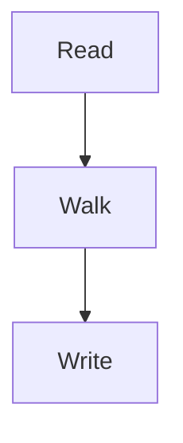
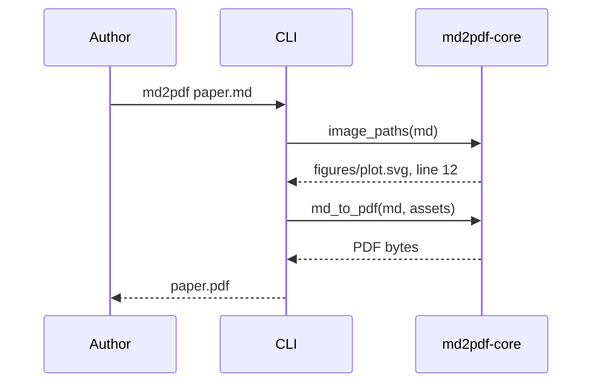

# Six bands

Six diagrams, each in a band of its own: one that fits its column at caption
size, one kept in its column by the tolerance, two that float across the page,
one that would float but has no caption to be found by, and one wider than the
page itself.

: The walk, top to bottom.

: The walk, left to right, and a little too wide for its column.

: Five steps, too wide to keep in a column.

: The CLI asks the engine twice. {#fig:sequence}

As  shows, the images are named before anything is compiled.
The diagram below has no caption, so it stays in its column however small that
makes it.

: Six steps, wider than the page.
