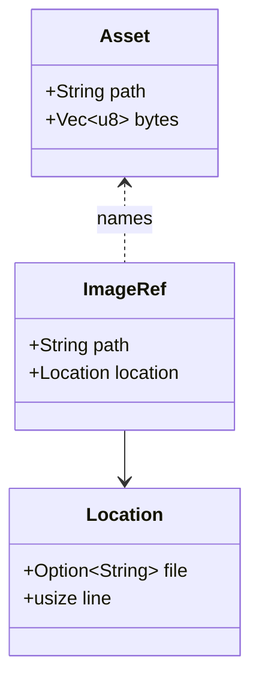

# The asset channel

The caller hands `core` every file the document names, as a path and its bytes.

```mermaid
classDiagram
    class Asset {
        +String path
        +Vec~u8~ bytes
    }
    class ImageRef {
        +String path
        +Location location
    }
    class Location {
        +Option~String~ file
        +usize line
    }
    Asset <.. ImageRef : names
    ImageRef --> Location
```

: What the caller supplies, and what names it.
