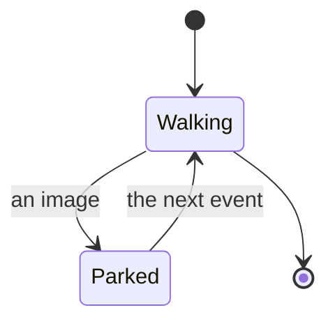

# The pending slot

An image's form is known one event late, so the walk parks it and the next event
settles it. The same machine is drawn twice, once under each keyword.

: The walk, under `stateDiagram`.

: The same walk, under `stateDiagram-v2`.
